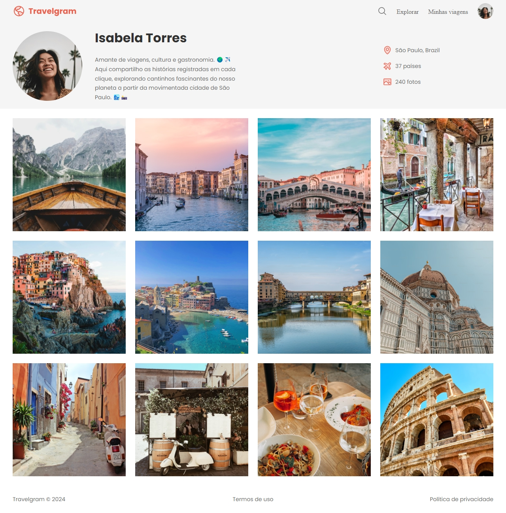

# 🌍 Travelgram

## 📚 What is a repository?

This repository showcases a simple web page built with HTML and CSS, designed to display a collection of travel photos in a style inspired by Instagram. The design includes a user profile section with travel information, a photo gallery, and a responsive layout that adapts to different screen sizes.

## 📝 Features

Profile Section: Display user information, location, and travel statistics.
Photo Gallery: A grid layout showcasing beautiful travel photos.
Responsive Design: Optimized for both desktop and mobile devices.

   

## 📫 Contact

Email: luisvitorioguerra@hotmail.com
LinkedIn: www.linkedin.com/in/josé-guerra-bb870219b